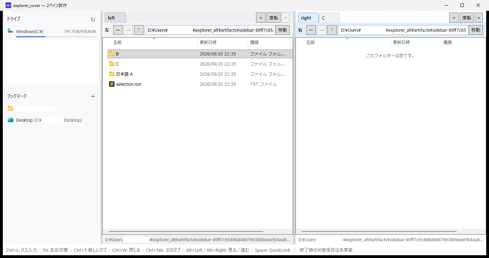

# explorer-cover

## explorer-coverとは

explorer-coverは、Windows Explorerのファイル操作をそのまま使いながら、ウィンドウの構成を使いやすくするための外側UIです。左右2ペインとタブを一つのウィンドウにまとめ、最後に使っていたタブ・パス・ペイン幅・ウィンドウ位置を保存して、次回起動時に復元します。

ファイル一覧の表示、右クリックメニュー、コピー・移動、ドラッグ＆ドロップなどの操作はWindows Shell／Explorerに任せます。explorer-cover自身がフルスクラッチのファイル管理機能を持つのではなく、Explorerを普段どおり使いながら、タブ、ショートカット、サイドビュー、QuickLook連携を追加する設計です。

主な機能:

- 左右2ペインと、各ペインの複数タブ
- タブ、パス、ペイン幅、ブックマーク、ウィンドウ位置・サイズの保存と復元
- Windows Shellによる右クリックメニュー、ドラッグ＆ドロップ、ファイル操作
- ドライブとブックマークを表示するサイドビュー
- WSLの`\\wsl.localhost\...`パスへの移動
- QuickLookを使ったSpaceキーのファイルプレビュー
- 設定画面からのキーボードショートカット変更



現在のバージョン: `0.1.0`（ファイル版 `0.1.0.0`）。

C#＋WPFで外枠を作り、Windows Shellの`IExplorerBrowser`を左右に埋め込んでいます。タブ、履歴、ブックマーク、状態復元、設定画面、QuickLook連携を備えています。機能ごとの説明と設計・検証記録は[ドキュメント一覧](docs/README.md)から参照できます。

## 日常利用版の起動・更新

`dist\explorer-cover\explorer-cover.exe`をダブルクリックすると、ビルドせずに起動できます。.NETを同梱しているため、起動時のSDKや環境変数の設定は不要です。exeへのショートカットからも利用できます。

更新は`update.cmd`を実行すると、通常版の終了・ビルド・起動をまとめて行えます。発行だけを行う場合はアプリを閉じて`publish.cmd`を実行します。成功後に通常版を切り替え、前の版は`dist\previous-日時-ID`へ退避します。設定やタブの保存先は従来と共通です。[起動・更新・前の版への戻し方](docs/RUNNING.md)を参照してください。

## 開発版・試用版の起動

この作業環境では、プロジェクト内の`.tools/dotnet`に.NET SDK 10.0.401を配置済みです。システムのPATH変更は不要です。

- **最初の試用:** `trial.cmd`をダブルクリックします。毎回、新しい試用フォルダーと日本語のサンプルファイルを作成して起動します。
- **開発版の起動・保存復元の試用:** `run.cmd`をダブルクリックします。前回の状態を復元します。初回は左右にユーザーフォルダーを表示します。
- `trial.cmd`やパスを明示した起動は一時セッションです。普段の保存状態を上書きしません。
- 起動時にReleaseビルドを行います。初回は少し時間がかかります。

PowerShellから左右の場所を指定する場合:

```powershell
.\run.ps1 -LeftPath 'D:\作業' -RightPath 'D:\資料'
```

別の環境では、Windows x64と.NET 10 SDK（WPFの開発に対応するWindows版）が必要です。SDKの`dotnet`がPATHにあれば、ローカルSDKがなくても起動できます。外部NuGetパッケージは使っていません。配布物に含まれる.NET／WPFランタイムと、別途インストールするQuickLookの扱いは[第三者ライセンス・同梱物](THIRD-PARTY-NOTICES.md)に記載しています。

## 操作

| 操作 | 方法 |
|---|---|
| フォルダーへ移動 | パス欄に入力してEnter、またはパス欄右端の→ |
| 一覧内のフォルダーを開く | ダブルクリック、またはEnter |
| パス欄へ移る | Ctrl+L |
| 左右の一覧を切り替える | F6 |
| パス欄から一覧へ戻る | Esc |
| 一覧からパス欄へ移る | Tab／Shift+Tab |
| 新しいタブ | ＋／Ctrl+T。ペインの起動時の場所を開く |
| タブを複製 | 重なった四角のアイコン／Ctrl+Shift+T。現在地を新しいタブで開く（履歴はコピーしない） |
| タブを閉じる | ×／Ctrl+W。最後の1タブは残す |
| タブを切り替える | 見出しをクリック、Ctrl+Tab／Ctrl+Shift+Tab。末尾から先頭へ循環 |
| タブの順序を変える | 見出しを左ドラッグ。同じペイン内で移動、Escape／バー外へのドロップで取消 |
| 見出しからタブを閉じる | 初期値は中クリック。選択中でないタブも直接閉じられる |
| 空白部分から新規タブ | タブバーの空白を左ダブルクリック |
| 戻る／進む | ←／→、Alt+Left／Alt+Right |
| ひとつ上へ | ↑／Alt+Up。ドライブのルートでは無効 |
| QuickLookでプレビュー | 一覧で単一ファイルを選択してSpace。もう一度押すと閉じる |
| コピー／切り取り／貼り付け | Ctrl+C／Ctrl+X／Ctrl+V |
| 名前変更 | F2。編集中のCtrl+Aで拡張子を含めて全選択 |
| ごみ箱へ移動 | Delete。確認の有無はWindows側の設定に従う |
| ペイン幅変更 | 中央の境界をドラッグ |
| サイドビューから移動 | ブックマーク／ドライブをクリック。直前にフォーカスしていたタブで開く |
| ブックマーク登録 | 「ブックマーク」見出しの右端の＋ |
| ブックマーク編集 | 項目の右クリックから名前変更・削除 |
| サイドビュー幅変更 | サイドビュー右側の境界をドラッグ |
| ドライブ容量更新 | 「ドライブ」見出しの右端の↻、または10秒ごとの自動更新。未接続は非表示 |
| 右クリック／ドラッグ＆ドロップ | シェルの標準動作を利用 |

ファイル操作は実際のファイルに対して実行されます。`trial.cmd`のサンプルで基本動作を確認できます。

## 試用の流れ

1. `trial.cmd`で起動し、左右の移動、幅変更、コピー、名前変更を試します。
2. Explorerとのドラッグ＆ドロップ、普段利用している右クリック項目を試します。
3. パス欄に普段の場所を入力して、フォーカスやキー操作の使い勝手を確認します。
4. [試用メモ](docs/TRIAL.md)に気付いた点を記録します。
5. 保存・復元は`run.cmd`で試します。タブ・幅・ブックマークを変更して閉じ、もう一度起動して確認します。ショートカットやマウス操作は左下の⚙から変更できます。

## 設定

左下の⚙からショートカット、マウス操作、QuickLookの起動先を変更できます。変更は設定画面で保存すると反映され、再起動後も維持されます。保存形式、対応キー、旧形式からの移行、環境変数を使った検証用設定は[設定画面の仕様](docs/SETTINGS.md)を参照してください。

## 制限

- 通常起動ではタブ・場所・選択中タブ・各幅・ブックマークを保存・復元します。ウィンドウの位置・サイズ・最大化状態も復元します。戻る／進むの履歴、一覧内の選択とスクロールは起動をまたいで復元しません。
- 保存先は`%LOCALAPPDATA%\explorer-cover\workspace.json`です。一時セッションでは保存しません。
- タブごとにシェルビューを保持するため、開く数に応じてメモリ使用量が増えます。左右ペイン間のタブ移動・別ウィンドウへの切り離し・閉じたタブの復元は未実装です。
- パス欄はファイルシステムのフォルダーを対象としています。仮想フォルダーの文字列表現を直接入力する機能はありません。
- 右クリックは今回の検証環境では従来型のシェルメニューです。Windows 11の新メニューと同一ではありません。
- ネットワーク、クラウド、すべてのシェル拡張、異なるDPIの複数モニター間移動は未検証です。
- アクセスできないパスはペイン下部にエラーを表示します。時間のかかるネットワークパスなどでの非同期化は今後の検討対象です。
- 試用フォルダーは自動削除しません。

機能ごとの制限・未検証範囲は[ドキュメント一覧](docs/README.md)から各機能の文書を参照してください。

## ライセンス

explorer-coverのコードは[MIT License](LICENSE)で提供します。自己完結型の配布物に含まれる.NET／WPFランタイムには別のMicrosoftライセンスと第三者通知が適用されます。QuickLookは同梱せず、別途インストールしたものに接続します。詳細は[第三者ライセンス・同梱物](THIRD-PARTY-NOTICES.md)を確認してください。

## 開発と検証

```powershell
$env:DOTNET_CLI_HOME = "$PWD\.tools\cli"
.\.tools\dotnet\dotnet.exe build .\src\ExplorerCover\explorer-cover.csproj -c Release
.\.tools\dotnet\dotnet.exe run --project .\tests\ExplorerCover.Core.Tests -c Release
.\.tools\dotnet\dotnet.exe run --project .\tests\ExplorerCover.QuickLook.Tests -c Release
```

検証結果は[検証記録](docs/VERIFICATION.md)に記載しています。`scripts/Verify-*.ps1`はWindowsのUI Automationを使う開発用スクリプトです。デスクトップ上の試作用ウィンドウと検証用フォルダーを操作するため、通常の操作と同時に実行しないでください。試用はこれらを実行せず`trial.cmd`だけで始められます。

診断ログが必要な場合は、起動前に`EXPLORER_COVER_LOG`へ書き込み可能なログファイルの絶対パスを指定します。初期化、移動、エラー、終了処理を記録します。通常起動ではログを書きません。

## 構成

- `src/ExplorerCover`: WPF画面とWindows Shell連携。`MainWindow.cs`が2ペイン配置、`BrowserPane.cs`がタブ・履歴・パス入力を扱います。
- `src/ExplorerCover.Core`: WPFに依存しない状態、コマンド、設定、永続化ロジック。
- `tests`: CoreとQuickLook通信のテスト。
- `scripts`: Windows上で画面やShell連携を確認する検証スクリプト。
- `docs`: 利用手順、機能仕様、設計・検証記録。[ドキュメント一覧](docs/README.md)を参照してください。

ShellのCOM・Win32連携は`src/ExplorerCover/Shell`にあります。シェルメソッド定義は[MicrosoftのWindows SDKヘッダー](https://github.com/microsoft/win32metadata/blob/main/generation/WinSDK/RecompiledIdlHeaders/um/ShObjIdl_core.h)を参照しています。
