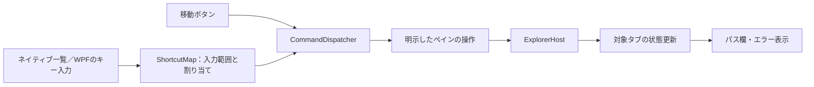

# 状態管理と操作基盤（段階5a）

実装日: 2026-09-20

## 状態の責務

`ExplorerCover.Core`はWPF・COMを参照しない.NETライブラリです。

| モデル | 保持する状態 |
|---|---|
| `WorkspaceState` | 左右のペイン、操作対象ペイン、左右幅の比率 |
| `PaneState` | タブの一覧と選択中タブ。別ペインのタブを選択せず、最後のタブを閉じない |
| `TabState` | ID、初期移動先、確定した場所、編集中のパス、エラー、履歴 |
| `NavigationHistory` | 成功した移動先と現在の履歴位置。履歴移動と新規移動を区別する確定処理 |

シェルから移動完了が届いたときだけ、対象タブの現在地と履歴を更新します。失敗時はエラーだけを変更します。パスの編集と現在地を分離しているため、入力しただけで現在地や履歴が変わることはありません。

段階5aでは画面は1ペイン1タブでした。段階5bでタブの切替・追加・破棄とビューの対応、履歴移動を接続しました。現在の設計と検証は[タブと移動](TABS.md)を参照してください。

## 入力と共通コマンド

- `CommandCatalog`が操作ID・名前・利用できる入力範囲・初期キーを定義します。
- `CommandDispatcher`は操作対象のペインを実行時に受け取り、実行可能か確認してから呼び出します。非アクティブ側の「移動」ボタンも、クリックした側だけを操作します。
- `PaneCommand`はWPFの`ICommand`への接続です。移動ボタンとパス欄の移動キーは同じDispatcherに接続しています。
- `ShortcutMap`はキーと入力範囲から操作IDを引きます。競合・誤記・予約キーは設定時に拒否します。
- `ShortcutService.ApplyJson`は全体の検証に成功した場合だけ設定を差し替え、変更を通知します。将来の設定画面はこの入口と`Reset`を利用できます。

ネイティブ一覧はWindowsメッセージ側、WPF側は`PreviewKeyDown`で処理し、二重実行を避けます。名前変更欄・IME処理中の入力は共通コマンドに流しません。割り当てたコマンドのキーリピートは消費して二重実行を抑え、該当しない一覧キーはシェルに渡します。文字編集用Ctrl+Aの既存補助はネイティブ編集欄に限定して残しています。

## 設定と保存の境界

この段階ではキー設定の読み込みと検証を実装しました。起動時のJSON指定方法はREADMEを参照してください。設定画面・設定の書き込み・作業状態の永続化は未実装です。

状態モデル、設定サービス、シェルの寿命を別々に管理することで、次の段階でタブ画面、保存処理、設定画面を順に接続します。現時点でWPFコントロールやCOM参照をJSONへ保存する設計にはしていません。

## 検証

- Coreテスト11件: 履歴の分岐・失敗時の不変性・タブとペインの独立・コマンドの実行対象と条件・キー変更／解除／初期値復帰・競合設定の非適用・形式エラー・入力キーの保護。
- `Verify-Foundation.ps1`: 初期キーでのコピー・左右切替・パス編集、フォルダー移動、JSONによるCtrl+K／F8／Ctrl+Gへの変更、旧キー解除、ボタンとの共通移動、競合時の初期値復帰を実画面で確認。
- IME: パス欄とシェルの名前変更欄で日本語の入力・変換・確定を確認。日本語名のファイルの左右間ドラッグ移動も確認。
- 初回の不正設定シナリオでコピー検証の待機がタイムアウトしたため、画面の移動完了とフォーカスが落ち着くまで待つよう検証スクリプトを修正し、当該シナリオを再実行して成功を確認。
- 診断ログ: `artifacts/foundation-default.log`、`foundation-custom.log`、`foundation-invalid.log`、`foundation-ime.log`。アプリは各検証後に通常終了。
